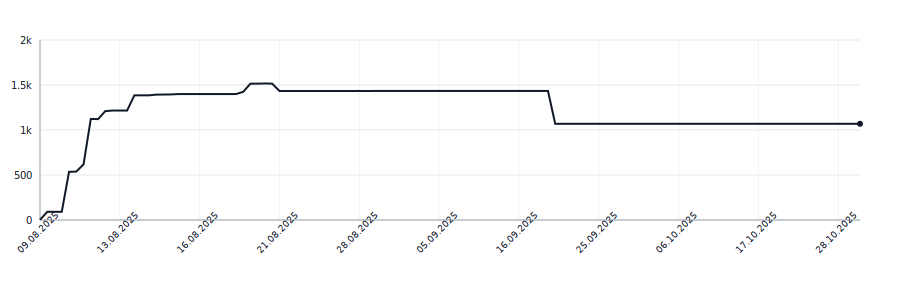

# syllabreak-swift

[](https://github.com/apakabarfm/syllabreak-swift/actions/workflows/tests.yml)

Multilingual library for accurate and deterministic hyphenation and syllable counting without relying on dictionaries.

This is a Swift port of [syllabreak](https://github.com/apakabarfm/syllabreak-python) Python library.

## Supported Languages

- 🇬🇧 English (`eng`)
- 🇷🇺 Russian (`rus`)
- 🇷🇸 Serbian Cyrillic (`srp-cyrl`)
- 🇷🇸 Serbian Latin (`srp-latn`)
- 🇹🇷 Turkish (`tur`)
- 🇬🇪 Georgian (`kat`)
- 🇩🇪 German (`deu`)

## Usage

### Auto-detect language

When no language is specified, the library automatically detects the most likely language:

```swift
import Syllabreak

let s = Syllabreak(softHyphen: "-")
print(s.syllabify("hello"))
// hel-lo
print(s.syllabify("здраво"))  // Serbian Cyrillic
// здра-во
print(s.syllabify("привет"))  // Russian
// при-вет
```

### Specify language explicitly

You can specify the language code for more predictable results:

```swift
let s = Syllabreak(softHyphen: "-")
print(s.syllabify("problem", lang: "eng"))  // Force English rules
// pro-blem
print(s.syllabify("problem", lang: "srp-latn"))  // Force Serbian Latin rules
// prob-lem
```

This is useful when:
- The text could match multiple languages
- You want consistent rules for a specific language
- Processing text in a known language

## Language Detection

The library returns all matching languages sorted by confidence:

```swift
import Syllabreak

let s = Syllabreak()
print(s.detectLanguage("hello"))
// ["eng", "srp-latn", "tur"]  // Matches English, Serbian Latin and Turkish
print(s.detectLanguage("čovek"))
// ["srp-latn", "eng", "tur"]  // Serbian Latin has highest confidence due to č
```

## Lines of Code

<picture>
  <source media="(prefers-color-scheme: dark)" srcset=".github/loc-history-dark.svg">
  <source media="(prefers-color-scheme: light)" srcset=".github/loc-history-light.svg">
  
</picture>